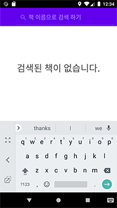
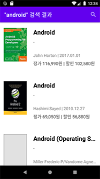
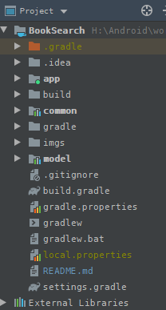
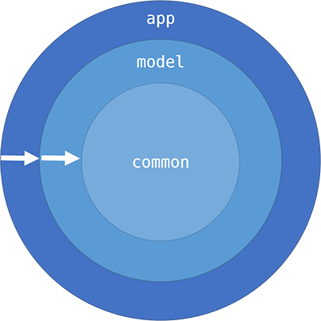
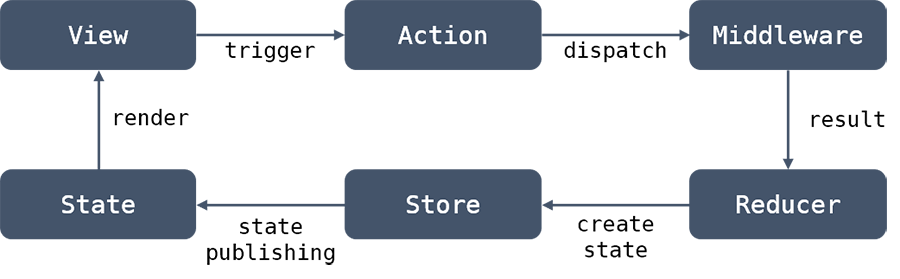

# BookSearch 

[카카오 책 API](https://developers.kakao.com/docs/latest/ko/daum-search/dev-guide#search-book)를 활용 해 도서 검색하는 앱 입니다.

## 1. used libraries

사용한 외부 라이브러리는 아래와 같습니다. 

- [kotlin](https://mvnrepository.com/artifact/org.jetbrains.kotlin/kotlin-stdlib-jdk7)
- androidx
  - [appcompat](https://developer.android.com/jetpack/androidx/releases/appcompat?hl=ko)
  - [recyclerView](https://developer.android.com/jetpack/androidx/releases/recyclerview?hl=ko)
  - [architecture lifecycle](https://developer.android.com/jetpack/androidx/releases/lifecycle?hl=ko)
  - [navigation](https://developer.android.com/jetpack/androidx/releases/navigation?hl=ko)
  - [paging](https://developer.android.com/jetpack/androidx/releases/paging?hl=ko)
  - [ktx core](https://developer.android.com/jetpack/androidx/releases/core?hl=ko)
  - [ktx-fragment](https://developer.android.com/jetpack/androidx/releases/fragment?hl=ko)
- [constraintlayout](https://developer.android.com/jetpack/androidx/releases/constraintlayout?hl=ko)
- [multidex](https://developer.android.com/studio/build/multidex?hl=ko)
- [rxandroid](https://github.com/ReactiveX/RxAndroid)
- [dagger](https://developer.android.com/training/dependency-injection/dagger-android)
- [retrofit](https://square.github.io/retrofit/)
- [okhttp](https://square.github.io/okhttp/)
- [moshi](https://github.com/square/moshi)
- [glide](https://github.com/bumptech/glide)

## 2. App flow

#### 2.1. 처음 실행 시, `SerachView`에 커서 및 키보드 등장 -> 사용자 입력 대기 상태



#### 2.2 사용자 검색어 입력 후 -> api로부터 책의 목록 가져와 화면에 보여줌. 스크롤 시 다음 페이지 로딩 (`Paging` with `DataSource`)



#### 2.3 목록의 책 항목을 터치시 해당 책의 상세정보 화면으로 이동.


## 3. Modules 

아래와 같은 목적으로 `app`모듈을 분리 하였습니다. 

1. **비즈니스 로직 수행 코드**와 **뷰 로직 수행 코드**의 분리
2. 각 모듈 단위의 테스트 수행



각 모듈별 관계는 아래와 같습니다. 



- `app`모듈은 `common`, `model`모듈들을 알고 있습니다. 
- `model`모듈은 `common`모듈만 알고 있습니다. 
- `common`모듈은 다른 모듈과 관계를 갖고 있지 않습니다. 

### 3.1 `app` 모듈 

`app`모듈의 목적은 기존 `app`과 동일 하지만 비즈니스 로직을 제거 하고, 안드로이드 컴포넌트에 의존을 갖는 코드들이 존재 합니다.  

#### 3.1.1 `base` 패키지

- 공통적으로 사용 되는 클래스, 함수의 구현 및 확장 함수
- databinding에 사용 될 공통 binding adapter 함수
- `BaseActivity, BaseFragment` 클래스
- `Dagger` 컴포넌트 정의
  - `Application` scope singleton 정의 및 binds, provide 정의
  - 각 서브 도메인에서 사용 될 singleton scope network, reducer 모듈 정의
- `model`모듈 에서 `app`모듈에 의존을 갖는 리소스, 모듈 등에 접근 하기 위한 `Helper`인터페이스들의 구현 클래스. 

#### 3.1.2 `repositories` 패키지

- `Retrofit`에서 사용 될 `api`인터페이스 정의
- `model`모듈에서 네트워크 모듈을 사용하기 위한 `Repository`인터페이스의 구현 클래스. (보통 인터페이스 이름 뒤에 `impl`을 붙임)

#### 3.1.3 `view` 패키지 

- 각 도메인 별 `Activity, Fragment` 구현 
- `Dagger`에 사용 될 Activity, Fragment scope 컴포넌트 
- 안드로이드 컴포넌트, 뷰 에 의존을 갖는 클래스들
  - ex) `ListAdapter, ViewHolder, DiffUtil.Callback`등 의 구현. data binding adapter 함수 

#### 3.1.4 `resource`

- `Navigation` graph xml 파일 
- `Menu` 메뉴아이템 xml 파일
- `Toolbar`에 `SearchView`를 사용 하기 위한 `searchable` xml 파일

### 3.2 `model` 모듈 

`model`모듈의 목적은 각 도메인별 비즈니스 로직의 수행과 `ViewModel`의 구현 및 관리 입니다.   
비즈니스 로직의 수행을 위해 관련된 기본, 공통모듈들의 구현 되어 있습니다. 

#### 3.2.1 `base` 패키지

- 각 서브 도메인에서 `app`모듈에대한 의존이 필요한 경우(리소스 id, AOS의존 생기는 작업 등) 해당 작업을 정의한 인터페이스 인 `Helper`의 정의.
- 후술할 `redux`에 대한 인터페이스들과 구현 클래스들. 
- `BaseViewModel` 
  - `reactivex`옵저버 관련하여 disposabler객체를 안드로이드 컴포넌트 생명주기에 동기화 하여 필요시 `dispose()`시켜주는 `RxDisposer`인터페이스. 
- 그 외 유틸리티 함수 및 확장 함수들 

#### 3.2.2 `domain` 패키지 

- 서브 도베인별로 나뉘어진 하위 패키지
  - 후술할 `redux`에서 사용 될 인터페이스, 클래스들
    - `Action, State, Reducer, ActionProcessor(필요할 경우)`
  - 도메인에 종속된 `Helper`인터페이스 들
  - `ViewModel`클래스 들
    - `LiveData`로 이루어진 데이터 매핑 인스턴스 들
    - `redux`에서 전달받은 `State`를 처리 하는 `render()`함수 구현
  - `RecyclerView`에서 사용 될 클래스 들
    - 아이템 데이터 클래스
    - `Paging`하기 위해 제공될 `DataSource`의 구현과 `DataSourceFactory`클래스
- 공통 도메인 하위 패키지

### 3.3 `common` 모듈 

- `Constants`글로벌 상수 들
- `string` 문자열 리소스 xml
- 그 외 유틸리티 및 확장 함수들

## 4. Redux base event handling

[Redux](https://redux.js.org/introduction/getting-started)는 자바스크립트 환경에서 사용 하는 글로벌 상태 관리 도구 입니다. 

일반적으로 어플리케이션에서는 비즈니스 로직과 뷰 의 관계를 갖는데, 이 때 뷰의 업데이트를 위해서는 뷰에 대한 상태를 관리 할 필요가 있습니다. 하지만 비즈니스 로직등으로 인한 콜백으로 인하여 뷰의 업데이트는 항상 최신 상태임을 보장 할 수 없습니다. 

Redux에서는 이런 문제를 해결 하기 위해 화면의 상태를 정의한 `State`을 두어 단방향 데이터 흐름(Uni-Directional data flow)을 기반으로 비즈니스로직과 화면의 갱신을 단순하게 처리 할 수 있도록 해줍니다. 

### 4.1 Redux basic 



간단한 예로 로그인 하였을때에 대해 흐름을 보면, 

- 사용자가 id, pw를 입력 하고 난 뒤 로그인 버튼 을 눌렀다. 
  - 버튼 view를 통해서 `RequestLoginAction(id, pw)`을 생성 하고 이를 `Store`를 이용해 `dispatch()`한다.
- `RequestLoginAction`은 `List<Middleware>`들을 이터레이션 하여 다른 `ResultLoginAction`으로 처리 된다. 
  - 이때 보통 local, remote repository를 통해 결과를 얻는다. 이 때 결과는 `Success`뿐만 아니라 `Failed`, `Error`혹은 기존 Action 그대로 일 수도 있다.
  - 발생한 (Result)Action은 다시 `Store`를 이용해서 `dispatch()`될 수 있다. 
- `ResultLoginAction`은 `List<Reducer>`들을 이터레이션 하면서 새로운 `LoginSuccessState`로 생성 된다. 
  - Reducer의 `reduce()`함수를 통해 이전 `oldStat`와 미들웨어를 통해 전달 받은 (Result)`Action`을 이용해 새로운 `State`를 생성한다. 하지만 이 때 꼭 새로운 `State`가 생성되지 않으며 이전 `oldState`를 그대로 반환할 수도 있다. 
- 생성된 `LoginSuccessState`는 `Store`에 저장된다. 
- `Store`의 `BehaviorSubject`스트림을 구독중인 모든 스트림에서는 방금 생성된 `LoginSuccessState`를 `Observable`소스로 받아 `ViewModel`에서 `render()`함수를 통해 처리 하여 `View`를 갱신한다. 

#### 4.2 Action

```kotlin
// marker interface 
interface Action

// domain Action
sealed class LoginAction: Action
data class RequestLoginAction(val id: String, pw: String): LoginAction()
data class ResultLoginSuccessAction(val user: User): LoginAction()
// ... more actions
```

`Action`은 View(사용자로부터) 혹은 다른 Action 에 의해 발생한 Result, Success, Failed, Error 등의 Action 들을 정의 한 `immutable data class`입니다. 

`Action`은 `State`를 변하게 할 수 있는 유일한 Trigger 라고 할 수 있습니다. Action 은 후술할 `Store`를 통해 `dispatch()` 되어 비즈니스 로직을 태우거나 새로운 Action을 생성 할 수도 있다. 

#### 4.3 State

```kotlin
// marker interface
interface State

// domain State
sealed class LoginState: State
data class LoginSuccessState(val user: User): LoginState()
// ... more states
```

`State`는 후술할 `Reducer`를 통해 만들어진 `immutable data class`로서 화면의 상태를 정의 합니다.

`State`는 `Store`에 마지막 인스턴스혹은 Initialized State만 저장 됩니다. 그리고 Store 의 State는 오직 dispatch된 `Action`으로만 변경 될 수 있습니다.

Redux 기반 안드로이드 아키텍쳐 에서는 `Store`에 `BehaviorSubject`을 통해 발행 되는 `Observable`의 `State`인스턴스는 `ViewModel`의 `render()` 함수를 통해서 핸들링 합니다.

```kotlin
// rendering of State
class SomeViewModel: ViewModel() {
    fun render(state: State): Boolean {
        return when (state) {
            is LoginSuccessState -> {
                saveUserInfos(state.user)
                true
            }            
            else -> false
        }
    }
}
```

#### 4.4 Store

```kotlin
interface Store<S : State> {
    fun dispatch(action: Action)
    fun getStateListener(): Observable<S>
    fun getCurrentState(): S
}
```

`Store`는 `State`를 변경하기 위해 `Action`을 dispatch 하거나, 최신의 `State`를 저장 하고 `State`의 발행 스트림을 얻을 수 있는 클래스이다. `Store`가 하는 일은 아래와 같습니다. 

- 마지막 혹은 Initialize `State`를 저장 합니다. 
- `State`를 변경 하기 위해서 `dispatch(Action)`함수를 통해 `Action`을 전달합니다.
- `State`의 변화를 감지 하고 변화된 `State`를 구독 하기 위해서 `getStateListener()`를 통해 콜백을 등록 합니다. 
- 마지막 혹은 Initialize 상태를 얻기 위해서 `getCurrentState()`함수를 이용 할 수 있습니다. 

`Store`에서는 State를 하나만 저장 할 수 있습니다. 하지만 Redux 기반 안드로이드 아키텍쳐 에서는 여러개의 도메인 `State`가 생길 수 있으므로 이를 `AppState`라는 클래스 내 에 `Map<Class, State>`와 같은 컬렉션을 이용해서 저장합니다. 

#### 4.5 Middleware

`Middleware`는 dispatch된 `Action`을 핸들링 하여 새로운 `Action`을 만들거나 그대로 반환합니다. 

`Middleware`는 여러개가 존재 할 수 있으며 이를 컬렉션에 저장 하여 `Store`에서 이터레이션 합니다. 미들웨어는 dispatch된 `Action`을 핸들링 하는데, 예를 들면 비즈니스로직이나 network API, local DAO 등 비동기 작업들이 주 대상입니다. 

미들웨어 에서 핸들링 되어 나오는 `Action`은 새로운 Action 혹은 이전 Action 그대로 반환하는 경우도 있습니다.

#### 4.6 Reducer

`Reducer`는 `Middleware`를 통해 전달 받은 `Action`을 이전 `State`와 함께 핸들링 하여 새로운 `State`혹은 이전 `State`를 그대로 반환합니다. 

`Reducer`는 도메인에 대해 1:1 관계를 가질수 있으며, 필요하다면 서브 도메인 으로 쪼개서 여러개를 가질 수 있습니다. 

## 5. ETC

#### 5.1 Paging with DataSource

#### 5.2 SearchView 

